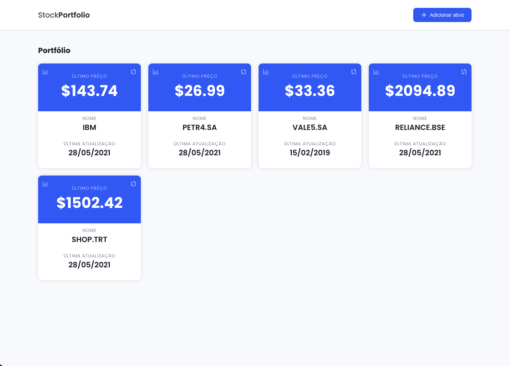
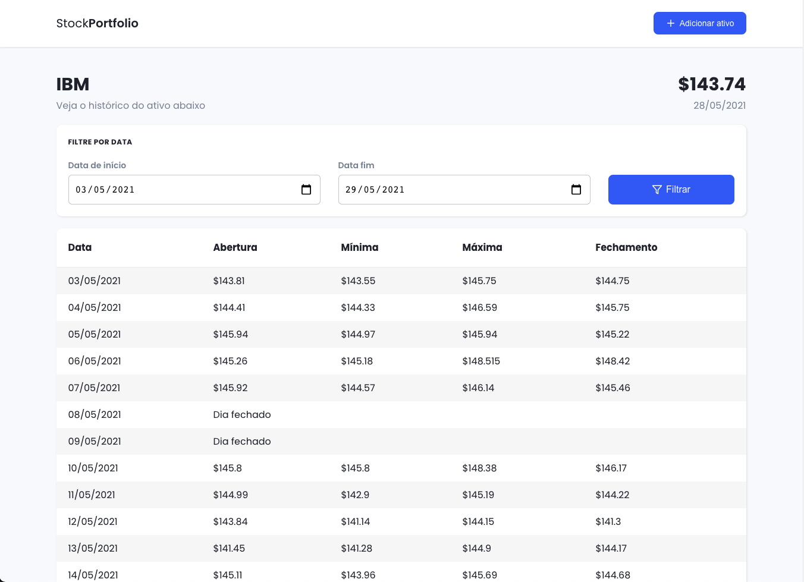
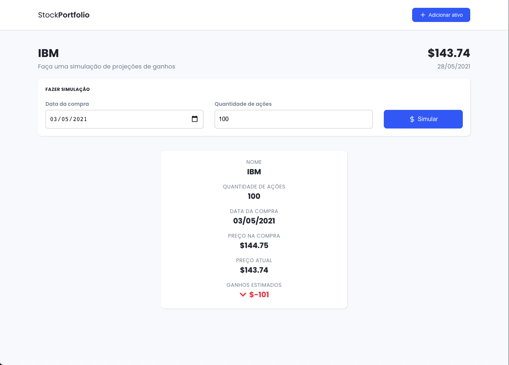
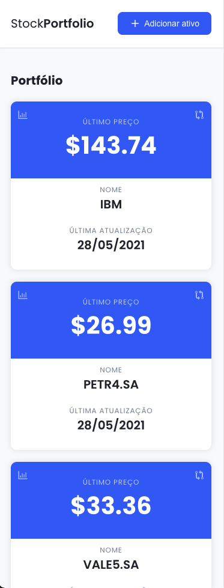

# Teste Técnico Alive

<a href="https://github.com/delkawy">
  
</a>



<br>
<br>

## Tópicos

[Sobre o teste](#sobre-o-teste)

[Funções](#funções)

[Tecnologias](#tecnologias)

[Instalação e Uso](#tecnologias)

[Screenshots](#screenshots)

<br>

## Sobre o teste

Este é a solução proposta ao teste técnico em <b>node.js</b>, conforme [as instruções](https://github.com/Alive-App/hiring/blob/main/node/README.md).

<br>

## Funções

### Front-end

Instruções passadas para o front-end podem ser [encontradas aqui](https://github.com/Alive-App/hiring/blob/main/node/README.md#frontend).

1. Incluir ações no portifólio;
2. Ver situação atual das ações (último preço e data e hora da atualização);
3. Ver histórico de preços de uma ação, podendo delimitar datas de início e fim;
4. Fazer projeção de ganhos de uma ação, determinando o número de ações compradas e a data de compra no passado.

<br>

### Back-end

Instruções passadas para o back-end podem ser [encontradas aqui](https://github.com/Alive-App/hiring/blob/main/node/README.md#backend).

1. Retorna a cotação mais recente para a ação
2. Retorna preço histórico da ação num intervalo inclusivo
3. Compara uma ação com uma ou mais ações
4. Projeta ganhos com compra em uma data específica

<br>

## Tecnologias

Foram utilizados as seguintes tecnologias:

- [Node](https://nodejs.org/en/)
- [Express](https://expressjs.com/)
- [TypeScript](https://www.typescriptlang.org/)
- [Next.js](https://nextjs.org/)
- [Jest](https://jestjs.io/)

<br>

## Instalação e uso

### API (Back-end)

```bash
# Clone o repositório
$ git clone https://github.com/delkawy/hiring.git

# Entre na pasta
$ cd node/test/backend

# Instale as dependências
$ yarn install ou npm install

# Faça uma copia do .env.example, renomeie para .env e configure suas variáveis
$ cp .env.example .env

# Rode o servidor
$ yarn dev ou npm run dev

# (opcional) Rodar os testes
$ yarn test ou npm run test
```

<br>

### Web (Front-end)

```bash
# Entre na pasta
$ cd node/test/frontend

# Instale as dependências
$ yarn install ou npm install

# Faça uma copia do .env.example, renomeie para .env e configure suas variáveis
$ cp .env.example .env

# Rode o servidor
$ yarn dev ou npm run dev

# (opcional) Rodar os testes
$ yarn test ou npm run test
```

<br>

## Screenshots

### Home


<br>

### Histórico



<br>

### Projeção de ganhos



<br>

### Responsividade


